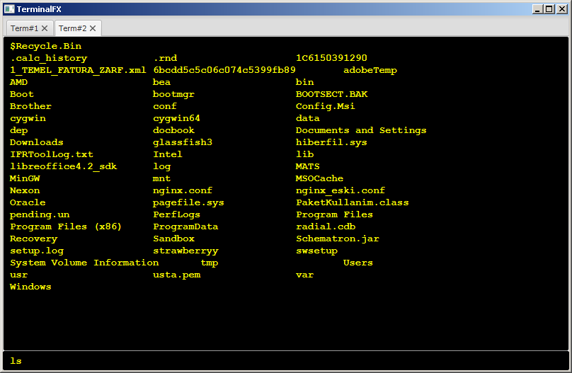

== JavaFX Terminal Emulator

TerminalFX is a terminal emulator application written in JavaFX 8.

== How to run

[source,bash]
----
git clone https://github.com/rahmanusta/TerminalFX
mvn clean install
mvn exec:java -Dexec.mainClass="com.kodcu.MainApp"
----

== Licence

MIT